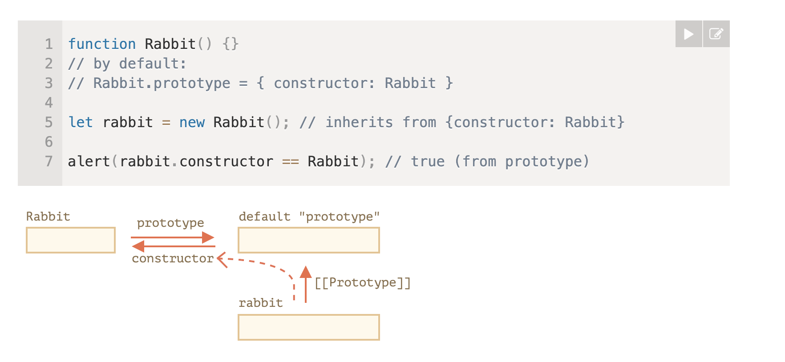

# JavaScript 基础串联

## 执行上下文

调用函数时，`JavaScript`创建一个执行上下文压入调用栈。

执行上下文包含：

- 词法环境
  - 环境记录（Environment Record）：存放局部变量`const/let`声明的变量和函数声明
  - 外层引用（outer）
    - 函数定义时，函数的`[[Environment]]`隐藏属性记录对外层词法环境的引用，创建词法环境时`outer`通过`[[Environment]]`得到引用
    - **作用域链**：当访问一个当前词法环境內缺失的变量时，沿着外层引用链到外层词法环境中找，直至找到或到根部停止
    - **闭包**：内部函数总能访问外部函数的变量和函数，因为`[[Environment]]`一直都在，能一直找到外层词法环境。只要词法环境可达，即使函数已经执行完毕，其词法环境也不会被销毁。
  - This 绑定（This Bindings）
    - `object.method()`
      - 以对象方法的形式调用时，点符号返回一个中间值`(base, name, strict)`传递给调用括号。如果使用`obj = object.method`再调用`obj()`，引用类型被丢弃，调用时也就无法得到原有`this`信息，那么如何使函数调用一直保持原有`this`信息呢？👀 函数绑定
    - 全局作用域下，`this`指向`global`
    - 普通函数调用，非严格模式指向`global`，严格模式指向`undefined`
    - `apply/call`
    - 构造函数中调用
- 变量环境：保存`var`声明的变量

### 函数绑定

`func.bind(context, arg1, arg2)`

函数绑定后返回一个类似函数的特殊对象，调用它时，它会把调用传递给`func`，并设置`this=context`，

P.S. `.bind(context[,...args])`也可以指定参数来产生偏函数哟。

## 原型

对象都有隐藏属性`[[Prototype]]`，称为原型，`[[Prototype]]`指向另一个对象时构成原型链。当从对象中读取一个缺失的属性时，`JavaScript`会自动延原型链向上查找。

`__proto__`属性是`[[Prototype]]`的一个`getter/setter`。

同时也可以使用`Object.getPrototypeOf(obj)`和`Object.setPrototypeOf(obj)`访问到`[[Prototype]]`

函数对象都有`prototype`属性，默认是`{constructor: function}`（只有一个`constructor`属性的对象，`constructor`指向自身）



构造函数用于封装创建对象逻辑，达到可复用的效果。本质是常规函数，附加上函数名首字母大写和使用`new`调用的两个约定。使用`new`调用函数会发生什么呢？

`new F()`做了什么？：

- 创建空的对象 A
- 将 A 的`[[Prototype]]`指向**`F.prototype`**
- 将 A 作为上下文，执行`F`内部逻辑
- 返回返回值或者返回 A

```javascript
function _new() {
  // 4.1、我们处理参数
  // 检验第一个参数是不是函数。不是函数返回提示信息
  if (Object.prototype.toString.call(arguments[0]) !== "[object Function]") {
    throw "The first parameter must be a function."
  }

  // 4.2、创建一个空的简单JavaScript对象（即{}）；

  var obj = {}

  // 4.3、链接该对象（即设置该对象的构造函数）到另一个对象(我认为说的是目标函数对象，绑定原型) ；
  obj.__proto__ = arguments[0].prototype

  // 4.4、将步骤1新创建的对象作为this的上下文（大概是切换 this的意思，我们可以使用 apply 进行参数传递）；
  var res = arguments[0].apply(
    obj,
    Array.prototype.slice.call(arguments).slice(1)
  )

  // 4.5、如果该函数没有返回对象，则返回this（大概意思是说目标函数不存在返回值时，返回新对象，否则返回目标函数的返回值）。
  // 经过测试，使用 new 操作符时，
  // 目标函数返回值是 Object 就返回目标函数的返回值，
  // 否则就返回新对象
  return res instanceof Object ? res : obj
}
```

- `F`的内部逻辑初始化对象属性
- `F`的原型承载方法

```javascript
function User(name) {
  this.name = name
}
// 任何函数原型默认都具有构造器属性，
// 所以，我们不需要创建它

// 2. 将方法添加到原型
User.prototype.sayHi = function () {
  alert(this.name)
}

let user = new User("John")
user.sayHi()
```

这很容易让人想到“类”

```javascript
// class User
class User {
  constructor(name) {
    this.name = name
  }
  sayHi() {
    alert(this.name)
  }
}
```

技术上来说，`User` 是一个函数，函数内部是`constructor`的内容，`methods`、`getters` 和 `setters` 都被写入了 `User.prototype`。

纯函数定义的类和使用`Class`定义的类有一些差异：

- 通过 `class` 创建的函数具有特殊的内部属性标记 `[[FunctionKind]]:"classConstructor"`，调用类构造器时必须要用 `new` 关键词。
- 类方法不可枚举，`enumerable`标志设置为`false`；在`for...in...`中类方法不会出现。
- 类总是使用 `use strict`。

## 继承

每个函数都有`prototype`，默认内容是`{constructor: function}`，一个对象。

一个对象有`[[Prototype]]`，连接其他对象形成原型链便可以访问连接对象上的方法。

`Func.prototype.__proto__ === Function.prototype`

所有内建对象最终都连接到`Object.prototype -> null`，因此说`JavaScript`中一切都来自对象。

想要切断这个默认关联，可以使用`Object.create(null);`


类继承

```javascript
class Child extends Parent {}
```

本质上做了两件事：

- 继承方法：`Child.prototype`的`[[Prototype]]`指向`Parent.prototype`

- 继承静态方法：`Child.__proto__ === Parent`，内建对象不会继承`Object`的静态方法(`Object.keys`/`Object.values`之类)

```javascript
new Child()
```

- 调用`Parent`的`constructor`，如果`Child`中有重写`constructor`，需要通过`super()`调用`Parent`的`constructor`（）
- 将对象的`[[Prototype]]`指向`Child.prototype`

类检查

`obj instanceof Class`/`Class.isPrototypeOf(obj)`，沿着`obj`原型链是否能找到`Class.prototype`

`({}).toString.call(obj)`，调用`obj[Symbol.toStringTag]`方法获取 Str，返回`[Object Str]`

## 可迭代(iterable)

**可迭代对象(iterable object)**：拥有`[Symbol.iterator]`方法，调用该方法获得**迭代器(iterator)**，`for...of...`是一个能够遍历它的很好的语法。

可迭代对象是数组/字符串的泛化，数组/字符串有可迭代的特性，但可迭代对象不是数组无法使用数组元素的方法，可以通过`Array.from()`转换为数组使用。

同时，也可以通过自定义`[Symbol.iterator]`方法自建可迭代对象。

**迭代器(iterator)**：一个有`next`方法的的对象，`next`方法返回`{value:..., done:...}`对象。调用`next`进入下一个迭代。

**Generator 函数**调用的时候会返回一个**生成器对象（generator）**，生成器对象是可迭代的，上面有`next`方法。`generator.next()`恢复 Generator 函数块內代码执行，执行到最近的`yield`语句，并且返回`{value:.., done:...}`对象：

- `value`: 产出的（yield）的值。
- `done`: 如果 generator 函数已执行完成则为 `true`，否则为 `false`。

```javascript
function* generateSequence() {
  yield 1
  yield 2
  yield 3
}

let generator = generateSequence()

let one = generator.next()

alert(JSON.stringify(one)) // {value: 1, done: false}
```
