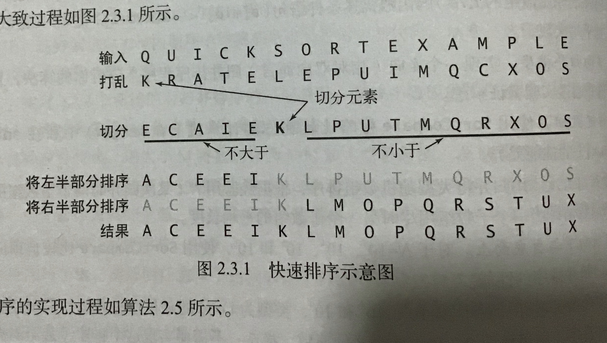
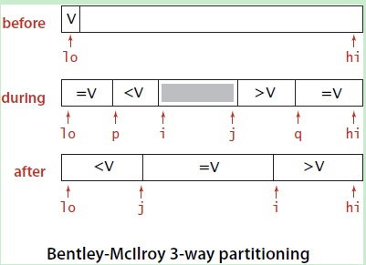
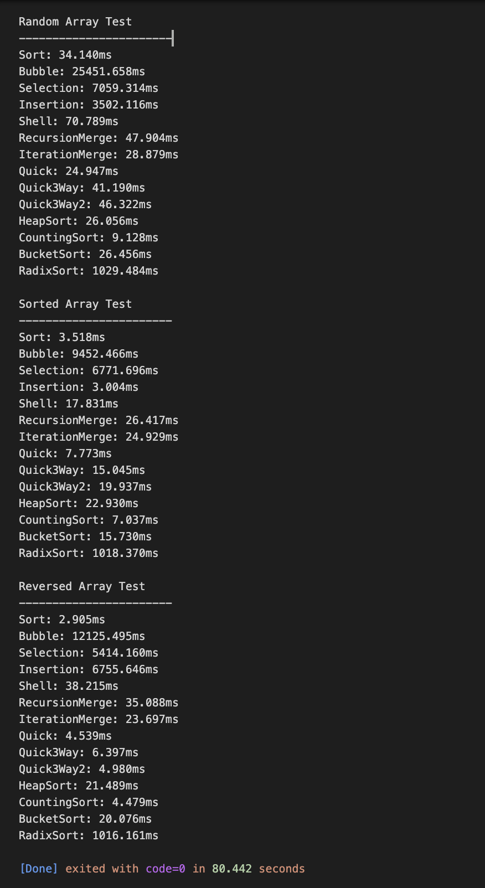

# 排序

## 前导说明

文中整理了十种经典排序算法，涵盖思路介绍、代码实现、效率分析。希望用简单的方式讲清各种排序的来龙去脉。


文中各排序类继承自`Sort`基类：

``` javascript
class Sort {
  static less(v, w) {
    return v < w;
  }
  static equal(v, w) {
    return v === w;
  }
  static exch(array, i, j) {
    [array[i], array[j]] = [array[j], array[i]];
  }
  static isSorted(array) {
    for (let i = 1, len = array.length; i < len; i++) {
      if (this.less(array[i], array[i - 1])) {
        return false;
      }
    }
    return true;
  }
  static sort(array) {
    return array.sort((a, b) => a - b);
  }
}
```

## 冒泡排序


### 思路介绍

从左到右比较相邻的两个元素，小的放在前面。一次循环完毕，最大值沉积到最后。

如此往复，排序完成时最小值自然就冒到顶端了。

``` javascript
class Bubble extends Sort {
  static sort(array) {
    const N = array.length;
    for (let i = 0; i < N - 1; i++) {
      for (let j = 0; j < N - 1 - i; j++) {
        if (this.less(array[j + 1], array[j])) {
          this.exch(array, j, j + 1);
        }
      }
    }
    return array;
  }
}
```

### 效率分析

比较次数： ~$N^2/2$

交换次数： ~$N^2/2$

最坏情况：逆序，~$N^2/2$次比较，~$N^2/2$次交换

最好情况：正序，~$N^2/2$次比较，0次交换

## 选择排序


### 思路介绍

冒泡排序需要一边比较一边替换，那么是不是可以先通过比较找到目标位置， 再交换呢？比如找到最小元素放到最前面。

遍历数组选择最小的元素，和数组的第一个元素交换。

遍历剩下的元素选择最小的元素，和数组的第二个元素交换。

如此往复，直到整个数组排序。

``` javascript
class Selection extends Sort {
  static sort(array) {
    const N = array.length;
    for (let i = 0; i < N; i++) {
      let min = i;
      for (let j = i + 1; j < N; j++) {
        if (this.less(array[j], array[min])) {
          min = j;
        }
      }
      this.exch(array, i, min);
    }
    return array;
  }
}
```

### 效率分析

比较次数：~$N^2/2$

交换次数：$N$

最坏/最好情况：所有输入都需要~$N^2/2$次排序，交换次数在0~N之间，没有太大区别

### 附加说明

选择排序的效率和数组的初始状态无关，不管是有序数组还是全相等数组都需要进行N^2级的比较，选择排序的效率更加依赖于数组规模。

选择排序的交换次数和数组大小是线性关系。选择排序最多交换N次，在大多数情况下选择排序比冒泡排序效率好一些。

## 插入排序

### 思路介绍

冒泡和选择排序受限于找到最大/最小值的思路，在一轮中需要把无序序列从头到尾比较一遍，似乎可以优化。

插入排序，类似于整理扑克牌的思路，取出未排序的元素放入有序序列中正确的位置。

实现时

- 当前索引左边是有序序列，右边是无序序列。

- 取无序序列的第一个元素，找到该元素在有序序列中的位置插入。

- 如此往复。

``` javascript
function insertionSort(array) {
  const N = array.length;
  for (let i = 0; i < N; i++) {
    for (let j = i; j > 0 && less(array[j], array[j - 1]); j--) {
      exch(array, j, j - 1);
    }
  }
}
```

### 效率分析

最坏情况：逆序，~$N^2/2$次比较，~$N^2/2$次交换

最好情况：正序，$N-1$次比较，0次交换

比较次数：平均情况~$N^2/4$

交换次数：平均情况~$N^2/4$

平均情况下每个元素都有可能向后移动半个数组的长度，是最坏和最好之间的折中估值


优化方案：取出无序元素，比较，向右移动较大元素


``` javascript
function insertionSort(array) {
  const N = array.length;
  for (let i = 1; i < N; i++) {
    const elem = array[i];
    let j = i;
    for (; j > 0 && less(elem, array[j - 1]); j--) {
      array[j] = array[j - 1];
    }
    array[j] = elem;
  }
}
```

### 附加说明

**插入排序对于部分有序的数组十分高效，也适合小规模数组。**

在排序小数组时非常实用。


## 希尔排序

### 思路介绍

在插入排序的基础上进行改进：

- 插入排序对于部分有序的数组十分高效，也适合小规模数组
- 插入排序只会交换相邻的元素，元素只能从数组一端一点一点挪动到另一端，在处理**大规模乱序数组**时非常低效

希尔排序基于插排的上述特征进行改进

- 将**大规模乱序数组**简化为**小规模随机数组**分块排序
- **交换不相邻**的元素达到部分有序状态，再进行整体插排达成有序。

#### 增量

数组元素的位置间隔 称为 **“增量”**

如果以固定增量对数组进行分组，增量越大

- 元素的覆盖跨度越大
- 每组包含的元素数量越小

小规模的随机数组非常适合进行插排

如果我们设定增量N=length/2，那么将分到N组，每组包含2个元素

#### 增量序列

大增量小规模排序之后，缩小增量再排序，如此往复。最终增量值缩小为1时，数组整体已经是大范围有序的状态，只需进行微调，这时做整体插排效率极高。

上述过程中使用的增量组成{length/2,(length/2)/2...1}这样的序列称为**增量序列**

希尔排序也称为**递减增量排序**


``` javascript
class Shell extends Sort {
  static sort(array) {
    const N = array.length;
    let h = 1;
    while (h < Math.floor(N / 3)) {
      h = 3 * h + 1; // 动态计算gap
    }
    while (h >= 1) {
      for (let i = h; i < N; i++) {	// 处理每个元素
        let elem = array[i];
        let j = i;
        for (; j > 0 && this.less(elem, array[j - h]); j -= h) {
          array[j] = array[j - h];
        }
        array[j] = elem;
      }
      h = Math.floor(h / 3);
    }
    return array;
  }
}

```

### 附加说明

希尔排序增量递减分片排序的思路，还蛮有意思的。

在处理中等规模（代码测试大约是10000左右）的随机数组时，高级排序和希尔排序的效率旗鼓相当，希尔排序代码更加轻量。

但数据规模过大的场景还是需要高级排序，进入高级排序，归并排序和快速排序都是利用了分而治之的思想，堆排序则是利用二叉堆的结构，只是借助使用算法思维和数据结构提高排序效率，并没有其他太过复杂的东西。

## 归并排序

### 思路介绍

是分治思想的典型应用。分：大问题拆分为小问题，治：归并问题答案


归并排序可以使用自上而下的递归，或者自下而上的迭代实现。（递归和迭代是可互相转换的行为）

#### 自上而下递归

**最小步骤**：拆分出左序列和右序列 + 使用双指针有序归并左右序列

``` javascript
class RecursionMerge extends Sort {
  static sort(array) {
    const length = array.length;
    if (length < 2) {
      return array;
    }

    const middle = Math.floor(length / 2);
    const left = array.slice(0, middle);
    const right = array.slice(middle);
    return this.merge(this.sort(left), this.sort(right));
  }
  static merge(left, right) {
    const result = [];
    let lIndex = 0;
    let rIndex = 0;
    const leftLength = left.length;
    const rightLength = right.length;
    while (lIndex < leftLength && rIndex < rightLength) {
      if (this.less(left[lIndex], right[rIndex])) {
        result.push(left[lIndex++]);
      } else {
        result.push(right[rIndex++]);
      }
    }

    for (; lIndex < leftLength; lIndex++) {
      result.push(left[lIndex]);
    }

    for (; rIndex < rightLength; rIndex++) {
      result.push(right[rIndex]);
    }

    return result;
  }
}
```

*P.S.遇到一个注意点：之前的代码使用`Array.shift()`代替索引自增，数组`Array.shift()`需要将所有元素都向前移一位，会带来额外的性能消耗。*

由于`javascript`词法环境栈的运行机制，递归的最大深度受到限制，同时对栈的管理也会消耗额外资源。所以我们来研究一下迭代的实现方法。

自下而上，也就是从两两归并开始，进行归并的左右数组逐步增大，最终数组长度达到原始长度时排序完毕。

``` javascript
class IterationMerge extends Sort {
  static sort(array) {
    const N = array.length;
    for (let size = 1; size < N; size += size) {
      // size 子数组大小
      // 从左到右进行分组归并排序，每组包括左右子数组，即两个size长的数组
      for (let start = 0; start < N - size; start += size + size) {
        // start 分组的起始索引, end 分组的结束索引
        const middle = start + size - 1;
        const end = Math.min(N - 1, start + size + size - 1);
        this.merge(array, start, middle, end);
      }
    }
    return array;
  }

  static merge(array, start, middle, end) {
    const compareArray = array.slice(start, end + 1);
    let index = start;
    let lIndex = start;
    let rIndex = middle + 1;

    while (index <= end) {
      if (lIndex === middle + 1) {
        array[index++] = compareArray[rIndex++];
      } else if (rIndex === end + 1) {
        array[index++] = compareArray[lIndex++];
      } else {
        if (compareArray[lIndex] < compareArray[rIndex]) {
          array[index++] = compareArray[lIndex++];
        } else {
          array[index++] = compareArray[rIndex++];
        }
      }
    }
  }
}
```

测试比较后发现，迭代的效率明显低于递归的效率。

### 效率分析

平均复杂度：$O(NlogN)$


自顶向下归并排序的过程可以想象为一颗树

假设这颗树有$n$层，第$k$层有$2^k$个子数组，每个子数组有$2^{n-k}$个元素，使用双指针法排序需要比较$2^{n-k}$次，每层的比较次数为$2^k * 2^{n-k}=2^n$。$n$层总共为$n2^n$次

在归并排序的操作树中，$N$个元素能构成$lgN$层树，因此复杂度为$lgN * 2^{lgN} = NlgN$


## 快速排序

### 思路介绍

快速排序也是分治思想的一个典型应用。



简单描述一下最小步骤：

- 随意找一个基准元素，把小于等于元素的值放到元素左边，大于元素的值放右边。这一操作称为**切分**。
- 左右数组各自排序之后，整体也就自然有序了。

#### 切分

- 取第一个元素作为切分元素
- 从数组的左端向右扫描找到一个大于它的元素A
- 从数组的右端向左扫描找到一个小于它的元素B
- 交换A和B的位置
- 当两个指针相遇时，交换切分元素和左数组最末元素

``` javascript
class Quick extends Sort {
  static sort(array, left = 0, right = array.length - 1) {
    if (left >= right) return array;
    const pivot = this.partition(array, left, right);
    this.sort(array, left, pivot - 1);
    this.sort(array, pivot + 1, right);
    return array;
  }
  static partition(array, left, right) {
    const value = array[left];
    let lIndex = left;
    let rIndex = right + 1;

    while (true) {
      while(this.less(array[++lIndex], value)) if(lIndex === right) break;
      while(this.less(value, array[--rIndex])) if(rIndex === left) break;
      if (rIndex <= lIndex) break;
      this.exch(array, lIndex, rIndex);
    }

    this.exch(array, left, rIndex);
    return rIndex;
  }
}
```

### 效率分析

快排的最理想情况是按基准点正好对半切分，这种情况下依赖树和归并排序类似，效率~$NlogN$

设想每次切分后两个子数组之一总是空，那么每次调用只会移除一个元素，需要调用$N$次（递归深度$N$），总共需要比较$N^2/2$次。


平均复杂度：$NlogN$

最差情况：$N^2/2$，譬如总以第一个元素为基准值的有序序列

结论：**基准点的选择影响快排的实际效率**

### 优化

#### 基准点选择

方案一：随机打乱输入内容再进行排序

方案二：随机选择基准元素，可以避免在每次调用时都产生劣质的分割

方案三：三数中值，随机选取三个元素用它们的中值作为基准（把中值移动到尾部作为哨兵可以减免左指针的越界判断）

``` javascript
function quickSort(array, left = 0, right = array.length - 1) {
    if (left >= right) return array;

    dealPivot(array, left, right);
    const pivot = partition(array, left, right);

    quickSort(array, left, pivot - 1);
    quickSort(array, pivot + 1, right);

    return array;
}

function dealPivot (array, left, right) {
    const mid = Math.floor((left + right) / 2);

    if (array[left] > array[mid]) [array[left], array[mid]] = [array[mid], array[left]];
    if (array[left] > array[right]) [array[left], array[right]] = [array[right], array[left]];
    if (array[right] < array[mid]) [array[mid], array[right]] = [array[right], array[mid]];
    [array[mid], array[right - 1]] = [array[right - 1], array[mid]];
}

function partition (array, left, right) {
    const value = array[right - 1];
    let i = left;
    let j = right - 1;
    
    while (true) {
        while (array[++i] < value) {}
        while (array[--j] > value) if (j === left) break;
    
        if (i >= j) break;
        [array[i], array[j]] = [array[j], array[i]];
    }
    if (i < right) {
        [array[i], array[right - 1]] = [array[right - 1], array[i]];
    }
    return i;
}
```

#### 小数组使用插入排序

对于小数组，快速排序比插入排序慢。

待排序数组较小时使用插入排序可以小幅度优化，将递归代码中的

`if (left >= right) return array;` 改为

`if (left + M >= right) return Insertion.sort(); return;` 

`M = 5~15`

#### 三向切分的快速排序

当数组中有大量重复数据时，普通快排会按部就班递归，可以以此为突破口做些优化。

普通切分是二分，是不是能再切分出一块等于切分元素的部分

三向切分最小步骤：

- `i`指针是动态游标

- `lt`指针将小于的元素禁锢在左侧
- `gt`指针将大于的元素推到尾部区域

最终达到：

`a[lo..lt-1] < v = a[lt...gt] < a[gt+1...high]`

``` javascript
class Quick3Way extends Sort {
  static sort(array, left = 0, right = array.length - 1) {
    if (left >= right) return array;
    this.dealPivot(array, left, right);
    let lt = left;
    let gt = right;
    let i = left + 1;
    const value = array[left];

    while (i <= gt) {
      if (array[i] < value) this.exch(array, i++, lt++);
      else if (array[i] > value) this.exch(array, i, gt--);
      else i++;
    }
    
    this.sort(array, left, lt - 1);
    this.sort(array, gt + 1, right);
    return array;
  }
}
```

在数组中重复元素不多的普通情况下，三向切分比标准二向切分更多次交换，反而慢很多。但据说快速三向切分算法能解决这个问题。

#### 快速三向切分



在二分切分算法的基础上加`p`/`q`两个指针，在数组两端维护`=v`的区域。

`p`指向左端`=v`的最后一个元素

`q`指向右端`=v`的第一个元素

`j`指向`<v`的最后一个元素

`i`指向`>v`的第一个元素

最后将两端`=v`的区域替换到中间完成排序

*实测稍微快一些，但还是比归并和普通快排慢*


## 堆排序

### 思路介绍

有序二叉堆：一棵堆有序的完全二叉树

- 完全二叉树：从上到下，从左到右”放置结点。只用数组不需要指针就可以表示。
- 堆有序：每个结点下方连接两个大于等于它的子结点。

有序二叉堆的类型

- 大顶堆：每个节点的值都大于或等于其子结点的值，在堆排序算法中用于升序排列；

- 小顶堆：每个节点的值都小于或等于其子结点的值，在堆排序算法中用于降序排列；


#### 如何构造大顶堆？

大数上浮（swim）：按层级迭代向上找到自己的位置为止

``` javascript
function swin(k) {
  while (k > 1 && less(pq[k/2], pq[k])) { // 最高上浮到顶
    exch(pq, k/2, k);
    k = k/2;
  }
}
```

小数下沉（sink）：找到子节点里最大的节点替换

``` javascript
// pq的长度是N+1
function sink(pq, k, N) {
  while (2 * k < N) {
    let j = 2 * k;
		if (j + 1 <= N && less(pq[j], pq[j+1])) j++;	// 找到更大的子节点
    if (!less(pq[k], pq[j])) break;	//	确定根节点比子节点小
    exch(pq, k, j);
    k = j;
  }
}
```

堆排序

- 构造有序堆：从下往上建堆。从最后一个最小堆开始下沉（1）
- 下沉排序：删除根元素，用尾元素填补，小数下沉（2）

``` javascript
class HeapSort extends Sort {
  static sort (array) {
    // 数组从0开始
    // 从下到上构建堆有序：找到最后一个堆
    // 下沉排序
    let N = array.length;
    for (let k = Math.floor(N / 2) - 1; k >= 0; k--) this.sink(array, k, N);
    while (N > 0) {
      this.exch(array, 0, --N);
      this.sink(array, 0, N);
    }
    return array;
  }

  static sink (array, i, N) {
    while (2 * i + 1 < N) { // 有子节点
      // 找到更大的子节点
      // 比较节点大小
      // 替换
      let j = 2 * i + 1;
      if (j < N - 1 && this.less(array[j], array[j + 1])) j++;
      if (!this.less(array[i], array[j])) break;
      this.exch(array, i, j);
      i = j;
    }
  }
}
```

### 效率分析

​	~$2NlogN$次比较，恒定内存空间。


比较排序部分结束了，接下来是根据数据特征分布数据 -> 局部排序 -> 再合并的三种排序算法。

## 计数排序


``` javascript
class CountingSort extends Sort {
  static sort(array) {
    const maxValue = this.findMaxValue(array);
    const buckets = new Array(maxValue + 1).fill(0);

    array.forEach((value) => buckets[value]++);

    let sortedIndex = 0;
    buckets.forEach((value, i) => {
      while (value--) {
        array[sortedIndex++] = i;
      }
    });

    return array;
  }

  static findMaxValue(array) {
    let max = array[0];
    array.forEach((a) => (max = a > max ? a : max));
    return max;
  }
}
```

数组元素与计数数组索引映射


## 桶排序

通过逻辑映射（需要关联桶的顺序）把数据分布到不同的的桶中，各个桶内部排序，在把桶内数据拼装起来

``` javascript
class BucketSort extends Sort {
  static sort(array, bucketSize = 5) {
    let min = array[0];
    let max = array[0];

    array.forEach((elem) => {
      min = elem < min ? elem : min;
      max = elem > max ? elem : max;
    });

    const bucketCount = Math.floor((max - min) / bucketSize) + 1;
    const buckets = new Array(bucketCount).fill().map(u => ([]));

    array.forEach((elem) => {
      buckets[Math.floor((elem - min) / bucketSize)].push(elem);
    });
    array.length = 0;
    buckets.forEach((bucket) => array.push(...bucket.sort((a, b) => a - b)));
    return array;
  }
}
```

数组元素通过转换逻辑与桶映射


## 基数排序

是基于整数的排序，利用整数位数带有顺序信息的特征

数组整数元素通过位数映射到对应组

``` javascript
class RadixSort extends Sort {
  static sort (arr, maxDigit = 5) {
    let mod = 10;
    let dev = 1;
    const counter = [];
    for (var i = 0; i < maxDigit; i++, dev *= 10, mod *= 10) {
        for(var j = 0; j < arr.length; j++) {
            var bucket = parseInt((arr[j] % mod) / dev);
            if(counter[bucket]==null) {
                counter[bucket] = [];
            }
            counter[bucket].push(arr[j]);
        }
        var pos = 0;
        for(var j = 0; j < counter.length; j++) {
            var value = null;
            if(counter[j]!=null) {
                while ((value = counter[j].shift()) != null) {
                      arr[pos++] = value;
                }
          }
        }
    }
    return arr;
  }
}
```


## 附录

100000数据量运行效率对比：



排序及效率测试代码可访问[Github](https://raw.githubusercontent.com/curlywater/Algorithms/master/排序/Code.js)获取。


### 参考资料

《算法（第4版）》—— 第二章 排序

[十大经典排序算法](https://sort.hust.cc/)

[图解排序算法(二)之希尔排序](https://www.cnblogs.com/chengxiao/p/6104371.html)

[图解排序算法(四)之归并排序](https://www.cnblogs.com/chengxiao/p/6194356.html)