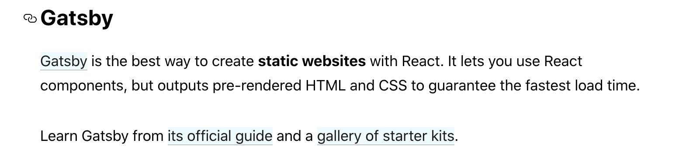

# 如何使用Gatsby构建个人站点

React团队将Gatsby作为基于React搭建静态站点的首选解决方案。Gatsby有什么特别之处呢？

- 基于React，方便使用React以及生态圈中的各类组件
- 开箱即用，轻松支持最新的Web开发技术，譬如Webpack打包，ES6编译，支持TS，各种CSS方案
- 构建预渲染页面，满足快速加载和SEO需求；构建静态资源，直接部署至各类服务平台
- 集成GraphQL，支持不同数据来源
- PWA生成器

Gatsby适用于构建内容类站点，譬如产品介绍站点[e.g. Figma](https://www.figma.com/)、帮助中心（用户手册）[e.g. Ghost Docs](https://www.gatsbyjs.org/showcase/docs.ghost.org)、开发者文档 [e.g. React JS](https://www.gatsbyjs.org/showcase/reactjs.org)、个人博客[e.g. Dan Abramov](https://overreacted.io/)。更多实例可以参见https://www.gatsbyjs.org/showcase

大致了解之后可见，想基于React开发个人站点，Gatsby确实是一个直接方案。

## 预先储备

如果想对Gatsby的基本使用有所了解，可以阅读这篇文章[《Gatsby概览》](./gatsby概览)，阅读官方文档后的一丢丢梳理。

看一些现有开源项目的实现

### [overreacted.io](https://github.com/gaearon/overreacted.io)

- Typegraphy.js提供排版系统支持，各级标题、段落、列表之间协调
- 多主题实现
  - 增加`window.__setPreferredTheme`函数，供主题切换调用
    - 修改body className
    - 更新localStorage
  - CSS自定义属性
  - 组件部分的主题通过局部State控制，增加`window.__onChangeTheme`函数，在主题更改时调用
- 多语言支持：单篇文章目录下放置不同语言版本markdown文件，`gatsby-node.js`中遍历所有文章生成`translationsByDirectory`

## 开工

由于规划的数据源结构和overreacted.io完全不同，即overreacted.io的大量逻辑部分无法复用，因此选择以[gatsby-starter-blog](https://www.gatsbyjs.org/starters/gatsbyjs/gatsby-starter-blog/)起手。

### 样式方案

