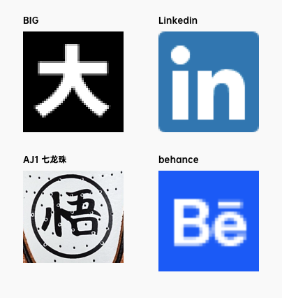

# 个人站点实现过程

## LOGO设计

由于是我的个人站点，也就围绕明确的个人特征，简单确定两个要素：英文名CURLY，中文昵称“卷毛”。

### 资料收集

实用文章：[零基础 5 分钟设计 logo](https://zhuanlan.zhihu.com/p/23317404)

参考实例：

### 动手设计

Sketch简单设计几个版本，最终确定使用

## 需求分析

站点划分两个分支：

- BLOG - 文章，分技术区、生活区、探索区三块专栏
- WORK - 成果，类似展览，展示做的还不错的项目

### BLOG

- 文章列表默认按时间展示所有文章（不划分专栏）
- 可切换专栏，展示指定专栏下文章
- 专栏下包含专题，专题分为文章集合和小册两类
  - 文章集合：文章之间没有明确顺序关系，按时间顺序展示文章列表
  - 小册：类似Gitbook

### WORK

- 图文分块式展现
- 点击进入项目介绍页

### 体验

- 支持夜间模式

## UI设计

<iframe style="border: 1px solid rgba(0, 0, 0, 0.1);" width="800" height="450" src="https://www.figma.com/embed?embed_host=share&url=https%3A%2F%2Fwww.figma.com%2Fproto%2FDn7rGsDDeNLyFMbISwsqDf%2FCURLY%3Fnode-id%3D1%253A2%26viewport%3D-1157%252C685%252C0.9079599976539612%26scaling%3Dscale-down&chrome=DOCUMENTATION" allowfullscreen></iframe>

**参考资料**

https://overreacted.io/ Dan Abramov的博客，承袭自gatsby-starter-blog，简单文章列表，直观

https://www.framer.com/blog/ 设计工具Framer的官方blog，分块式，有设计感

https://blog.gitbook.com/product/wrapping-up-the-transition-to-the-new-gitbook 作为整合型阅读工具，Gitbook观感很不错

## 代码实现

