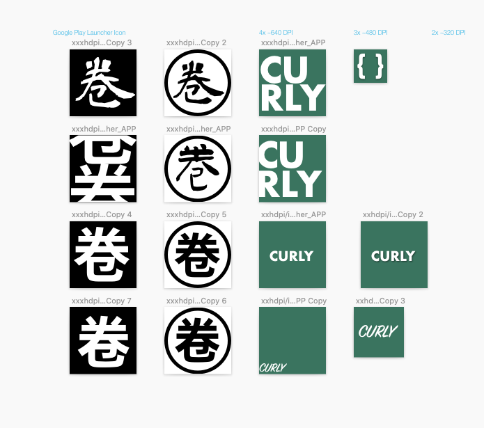

# 个人站点实现过程

## LOGO 设计

由于是我的个人站点，也就围绕明确的个人特征，简单确定两个要素：英文名 CURLY，中文昵称“卷毛”。

### 资料收集

实用文章：[零基础 5 分钟设计 logo](https://zhuanlan.zhihu.com/p/23317404)

参考实例：

### 动手设计

Sketch 简单设计几个版本，最终确定使用

## 需求分析

站点划分两个分支：

- BLOG - 文章，分技术区、生活区、探索区三块专栏
- WORK - 成果，类似展览，展示做的还不错的项目

### BLOG

- 文章列表默认按时间展示所有文章（不划分专栏）
- 可切换专栏，展示指定专栏下文章
- 专栏下包含专题，专题分为文章集合和小册两类
  - 文章集合：文章之间没有明确顺序关系，优先按排序，再则按时间排序展示文章列表

### WORK

- 图文分块式展现
- 点击进入项目介绍页

### 体验

- 支持夜间模式

## UI 设计

<iframe style="border: 1px solid rgba(0, 0, 0, 0.1);" width="800" height="450" src="https://www.figma.com/embed?embed_host=share&url=https%3A%2F%2Fwww.figma.com%2Fproto%2FDn7rGsDDeNLyFMbISwsqDf%2FCURLY%3Fnode-id%3D1%253A2%26viewport%3D-1157%252C685%252C0.9079599976539612%26scaling%3Dscale-down&chrome=DOCUMENTATION" allowfullscreen></iframe>

**参考资料**

https://overreacted.io/ Dan Abramov 的博客，承袭自 gatsby-starter-blog，简单文章列表，直观

https://www.framer.com/blog/ 设计工具 Framer 的官方 blog，分块式，有设计感

https://blog.gitbook.com/product/wrapping-up-the-transition-to-the-new-gitbook 作为整合型阅读工具，Gitbook 观感很不错

## 代码实现

React 团队将 Gatsby 作为基于 React 搭建静态站点的首选解决方案。Gatsby 有什么特别之处呢？

- 基于 React，方便使用 React 以及生态圈中的各类组件
- 开箱即用，轻松支持最新的 Web 开发技术，譬如 Webpack 打包，ES6 编译，支持 TS，各种 CSS 方案
- 构建预渲染页面，满足快速加载和 SEO 需求；构建静态资源，直接部署至各类服务平台
- 集成 GraphQL，支持不同数据来源
- PWA 生成器

Gatsby 适用于构建内容类站点，譬如产品介绍站点[e.g. Figma](https://www.figma.com/)、帮助中心（用户手册）[e.g. Ghost Docs](https://www.gatsbyjs.org/showcase/docs.ghost.org)、开发者文档 [e.g. React JS](https://www.gatsbyjs.org/showcase/reactjs.org)、个人博客[e.g. Dan Abramov](https://overreacted.io/)。更多实例可以参见https://www.gatsbyjs.org/showcase

大致了解之后可见，想基于 React 开发个人站点，Gatsby 确实是一个直接方案。

### 预先储备

如果想对 Gatsby 的基本使用有所了解，可以阅读这篇文章[《Gatsby 概览》](./gatsby概览)，阅读官方文档后的一丢丢梳理。

看一些现有开源项目的实现

#### [overreacted.io](https://github.com/gaearon/overreacted.io)

- Typegraphy.js 提供排版系统支持，各级标题、段落、列表之间协调
- 多主题实现
  - 增加`window.__setPreferredTheme`函数，供主题切换调用
    - 修改 body className
    - 更新 localStorage
  - CSS 自定义属性
  - 组件部分的主题通过局部 State 控制，增加`window.__onChangeTheme`函数，在主题更改时调用
- 多语言支持：单篇文章目录下放置不同语言版本 markdown 文件，`gatsby-node.js`中遍历所有文章生成`translationsByDirectory`

### 代码实施

由于规划的数据源结构和 overreacted.io 完全不同，即 overreacted.io 的大量逻辑部分无法复用，因此选择以[gatsby-starter-blog](https://www.gatsbyjs.org/starters/gatsbyjs/gatsby-starter-blog/)起手。

#### 项目结构

- 页面
  - 首页 - Home
  - 文章列表 - BlogIndex
  - 项目列表 - GalleryIndex
  - 文章展示/项目介绍（Markdown） - Post
  - 个人介绍 - About
- 组件
  - 专栏切换 - Dropdown
  - 主题切换 - Toggle

#### 样式方案

文章排版样式似乎是简单又深奥，就设计的角度来说里面或许有一些规范考究。

gatsby-starter-blog 依赖于 Typography.js，Typography.js 是基于 Vertical Rhythm 排版设计思想实现的一套工具，开发者可以通过 Typography.js 快速应用经典的文章排版，譬如 Github/WordPress，可做微调也可从零快速搭建自己的主题。更多介绍可以查看这篇文章[探索 Typography.js](/blog/tech/javascript/探索typography.js/)。

Typography.js 通过在`head`元素内插入`style`影响全局样式，如何处理应用于局部的需求？

提供一个小想法：Typography.js 提供`.toString()`方法返回组装完毕的样式代码，通过正则简单替换 body 部分，结合 Styled-Component 动态插入到局部组件中。

回到个人项目中，考虑到非文章相关页并不多，以及 Vertical Rhythm 排版设计思想应用于全局有保持一致性的优势，还是保留 Typography.js 的全局作用。而在局部，作为新尝试使用了 Styled-Component。

#### 组件实现

项目中只有两三个通用组件，适合使用什么方案？ant.design？material-ui？自行重写？
